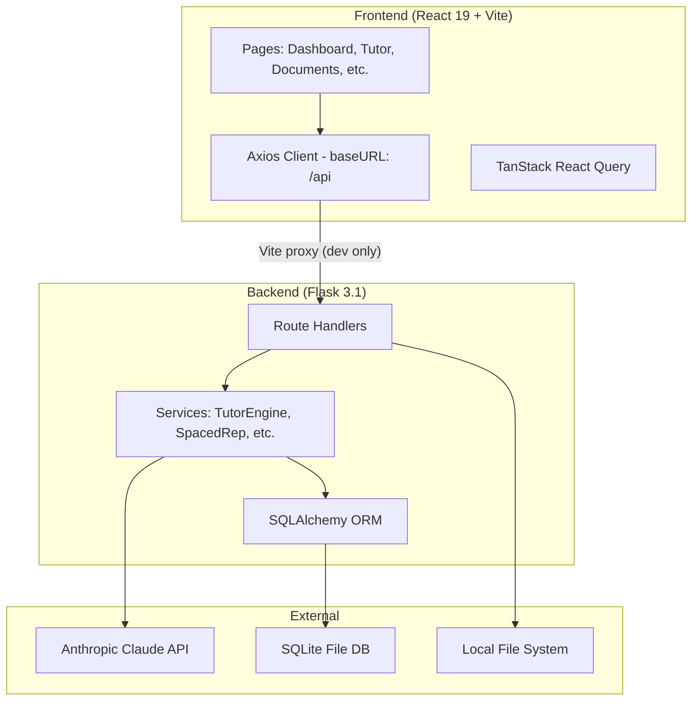

# LawFlow Production Readiness Assessment

**Recommended model:** `Opus 4.6` -- Complex multi-dimensional audit across security, infrastructure, and architecture

## Verdict: NOT Production Ready

LawFlow is a well-structured development prototype, but has critical gaps that must be addressed before any production deployment. The assessment is organized by severity.

---

## Architecture Overview

---

## CRITICAL -- Must Fix Before Production

### 1. No Authentication or Authorization

- All API endpoints are publicly accessible
- No user model, login system, JWT, or API keys
- Anyone with the URL can access all data and trigger AI calls (which cost money)
- **Files:** All routes in `api/routes/`

### 2. No HTTPS / Insecure Defaults

- `FLASK_SECRET_KEY` defaults to `"dev-secret-change-me"` ([api/config.py](api/config.py))
- `FLASK_DEBUG` defaults to `"true"`
- CORS hardcoded to localhost only ([api/app.py](api/app.py))

### 3. Hardcoded URLs in Frontend

- `frontend/src/api/converter.ts` has `http://localhost:5000/api` hardcoded
- API base URL (`/api`) relies on Vite dev proxy -- no production URL configuration
- No environment variable support in frontend (`import.meta.env` not used)

### 4. No Rate Limiting

- No protection against API abuse or DoS
- Claude API calls are expensive -- unlimited access is a billing risk

### 5. SQLite is Not Production-Grade

- Single-file database with no replication, limited concurrent write support
- No database migration system (Alembic) -- schema changes require full reset
- No backup strategy -- data loss risk

### 6. Debug Code in Production Files

- `api/services/tutor_engine.py` lines ~79-81 contain debug code that writes to the filesystem
- Should be removed entirely

---

## HIGH -- Should Fix Before Production

### 7. Zero Test Coverage

- No test files found anywhere (no `tests/`, `__tests__/`, `*.spec.*`, `*_test.*`)
- No test scripts in `package.json`
- No CI/CD pipeline to run tests

### 8. No Deployment Infrastructure

- No Dockerfile or docker-compose.yml
- No CI/CD config (.github/workflows, etc.)
- No WSGI server configured (Flask dev server is not production-grade)
- No process manager (gunicorn, uvicorn)

### 9. No Error Boundaries (Frontend)

- No React ErrorBoundary component -- unhandled errors crash the entire app
- `alert()` used for user-facing errors in some pages

### 10. Fragile Background Processing

- Document processing uses `threading.Thread` with daemon=True
- Jobs are lost on server restart
- No job queue (Celery, RQ) or task tracking

### 11. No Structured Logging

- Basic `logging.getLogger(__name__)` with no configuration
- No log levels, rotation, or output format configured
- No request/response logging middleware

### 12. Incomplete Error Handling

- SSE streaming only catches `ValueError` -- other exceptions break the stream silently
- No global exception handler for unexpected errors
- No retry logic for Claude API calls (rate limits, transient failures)

---

## MEDIUM -- Should Address for Robustness

### 13. No API Documentation (OpenAPI/Swagger)

### 14. No .env.example Template

### 15. No SEO Meta Tags (missing description, OG tags, favicon)

### 16. No MIME-type Validation for File Uploads (extension-only check)

### 17. No Pagination on List Endpoints

### 18. No Monitoring / Observability (no Sentry, no APM, no metrics)

### 19. Health Check is Shallow (`/api/health` doesn't check DB or Claude API connectivity)

---

## What IS in Good Shape

- Clean project structure with separation of concerns
- SQLAlchemy ORM prevents SQL injection
- Dependency versions pinned in `requirements.txt`
- React lazy loading / code splitting on all routes
- TypeScript strict mode enabled
- React Query for caching and data fetching
- Environment variables used for backend config (just need better defaults)
- Custom error classes defined (`APIError`, `ValidationError`, `NotFoundError`)

---

## Recommended Remediation Order

Phase 1 -- **Security Baseline** (Critical, before any deployment):

1. Add authentication (JWT or session-based)
2. Fix insecure defaults (secret key, debug mode)
3. Add rate limiting (Flask-Limiter)
4. Make all URLs environment-configurable
5. Remove debug code from tutor_engine.py

Phase 2 -- **Deployment Infrastructure**:
6. Add Dockerfile + docker-compose
7. Configure gunicorn/uvicorn as WSGI server
8. Add Alembic for database migrations
9. Set up CI/CD pipeline
10. Create .env.example

Phase 3 -- **Reliability**:
11. Add React ErrorBoundary
12. Replace daemon threads with a job queue
13. Add structured logging
14. Improve SSE error handling and retry logic
15. Add comprehensive tests

Phase 4 -- **Operational Maturity**:
16. Add monitoring (Sentry, health check enhancements)
17. Add API documentation
18. Consider PostgreSQL migration
19. Add backup strategy
20. Add pagination, MIME validation, SEO